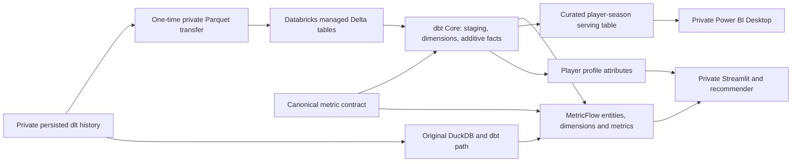

# ⚽ Soccer Scouting & Player Analytics Platform

An end-to-end soccer scouting platform that turns large-scale player statistics into **searchable player profiles, statistical recommendations, interactive analysis, and AI-assisted scouting explanations**.

Built with Python, dlt, DuckDB, dbt, Streamlit, and Gemini.

---

## Analytics engineering migration

The original DuckDB/dbt implementation remains available. This branch adds a
private Databricks/Delta migration path, shared canonical metric definitions and
an open-source MetricFlow semantic graph. The private workspace has passed migration parity and semantic validation;
Streamlit now queries metrics through MetricFlow and reads profile attributes from the curated facts and dimensions.



The fact grain is **player ? team ? league ? season stint**, with a 300-minute
minimum. Rate metrics divide aggregated additive inputs, so multi-season rates
remain weighted by playing time. Dribbling uses explicit `dribble_attempts_per90`
and `dribble_success_pct`; successful dribbles per 90 have the explicit name `successful_dribbles_per90`. Estimated
completed passes retain the original provider-percentage calculation.

See the [migration, validation and consumer guide](docs/databricks-migration.md)
for configuration, transfer commands, canonical formulas, tests and Power BI setup.
Python 3.11 and the checked-in `uv.lock` provide the validated dependency path.
No paid hosted dbt Semantic Layer is required. Streamlit stays local/private.
Set `SOCCER_BACKEND=databricks` in ignored `.env` for semantic queries on the cloud
warehouse, or `SOCCER_BACKEND=duckdb` for semantic queries on the preserved local database.
The application loads `.env` automatically; no download-back step is needed.

Underlying third-party sports data is intentionally excluded: do not commit
DuckDB databases, raw data, CSV/Parquet exports, migration artifacts, notebook
outputs, Power BI datasets, credentials or populated private configuration.

---

## Overview

Scouting players across leagues and seasons is more difficult than simply looking at goals, assists, or ratings. Analysts need to work with different levels of playing time, teams, competitions, positions, and dozens of performance metrics.

This project builds a data-driven workflow that helps answer questions such as:

- Who are the strongest players in a given profile?
- How does one player compare with another?
- Which players have similar statistical profiles?
- What do a player's performance patterns actually mean?
- Why did a player receive a particular scouting flag?
- What trade-offs should an analyst consider when comparing two players?

The platform combines a **data pipeline, analytical layer, recommendation system, interactive scouting application, and generative AI assistant** into one workflow.

---

## What the Platform Does

### 1. Builds an Analysis-Ready Player Dataset

Player and season statistics are collected from **API-Football** across five major European leagues:

- Premier League
- Ligue 1
- Bundesliga
- Serie A
- La Liga

The current pipeline covers **2020–2026**, representing 35 league-season combinations.

Raw API data is loaded into DuckDB using `dlt` and transformed with `dbt` into structured player-season records.

The transformation layer handles:

- Data type cleaning
- Position standardization
- Player/statistic joins
- Playing-time filtering
- Feature engineering
- Per-90 performance metrics

Players with fewer than 300 minutes are filtered out to reduce noise from extremely limited playing time.

### 2. Standardizes Player Performance

The analytical dataset contains **12,731 player-season records**.

Instead of relying only on raw totals, the platform calculates standardized metrics such as:

| Metric | Calculation |
|---|---|
| Goals / 90 | Goals × 90 / Minutes |
| Assists / 90 | Assists × 90 / Minutes |
| Key Passes / 90 | Key Passes × 90 / Minutes |
| Tackles / 90 | Tackles × 90 / Minutes |
| Dribbles / 90 | Successful Dribbles × 90 / Minutes |

This makes player comparisons more meaningful when players have different amounts of playing time.

---

## 🤖 AI-Assisted Scouting

The platform goes beyond displaying statistics by adding a **Gemini-powered AI scouting assistant** directly inside the player analysis workflow.

The goal is not to have AI replace the underlying analytics. Instead, the application first calculates the structured statistics and scouting signals, then gives Gemini the relevant analytical context so it can **explain what the numbers mean in natural language**.

### What the AI Can Do

On a **Player Profile**, the AI can:

- Summarize a player's statistical profile
- Explain trends shown in the charts
- Interpret radar/scatter chart values
- Explain deterministic scouting flags
- Answer follow-up questions about the player

For example, instead of requiring a user to interpret several charts independently, the AI can turn the underlying metrics and detected flags into a concise scouting explanation.

On the **Compare** page, the AI receives information about both players and can:

- Explain major differences between their profiles
- Identify strengths and weaknesses
- Discuss trade-offs between the players
- Evaluate the players against criteria supplied by the analyst
- Help the analyst understand why one player may fit a particular profile better

### AI + Analytics Architecture

The important distinction is that the AI does **not** independently analyze the entire database.

The workflow is:

```text
Player Data
    ↓
dbt / Analytical Models
    ↓
Player Metrics & Features
    ↓
Deterministic Scouting Flags
    ↓
Charts & Player Comparisons
    ↓
Selected Analytical Context
    ↓
Gemini
    ↓
Natural-Language Scouting Explanation
```

Gemini receives selected structured information such as player metrics, peer summaries, chart values, and scouting flags. It does not receive screenshots of the charts or the entire underlying dataset.

This keeps the AI layer grounded in the application's existing analytical results rather than asking a language model to independently invent conclusions from raw data.

### AI as Decision Support

The AI is designed as an analyst assistant, not an automated scout.

Its output can help explain patterns and surface trade-offs, but final player evaluation still requires human judgment and additional information such as:

- Video analysis
- Tactical fit
- Financial considerations
- Medical information
- Team needs

The application therefore uses AI to make quantitative analysis easier to interpret rather than replacing the scouting process.

---

## 🔎 Player Discovery

The platform also includes a statistical player recommendation system.

Given a known player, the system uses cosine similarity to identify players with similar performance profiles.

```text
Known Player
    ↓
Statistical Profile
    ↓
Similarity Calculation
    ↓
Similar Player Profiles
    ↓
Potential Players to Investigate
```

This turns the platform from a simple reporting dashboard into a player discovery tool.

An analyst can start with a player they already know and use the system to identify other players who may be worth further scouting.

---

## 📊 Streamlit Scouting Application

The Streamlit application brings the analytical and AI components together.

### Player Profile

Users can explore:

- Player information
- Team and league
- Position
- Playing time
- Performance statistics
- Per-90 metrics
- Visual performance charts
- Statistical scouting flags
- AI-generated explanations

### Player Comparison

Users can compare two players across their available performance metrics and use the AI assistant to help interpret the differences and trade-offs.

### Player Discovery

Users can move from a known player to statistically similar players and continue the scouting workflow.

---

## 🏗️ Data & Application Architecture

```text
                    API-Football
                         │
                         ▼
                 Python + dlt
                         │
                         ▼
                      DuckDB
                         │
                         ▼
                       dbt
                         │
                         ▼
              Analysis-Ready Data
                         │
              ┌──────────┴──────────┐
              ▼                     ▼
       Player Analytics      Similarity Engine
              │                     │
              └──────────┬──────────┘
                         ▼
                    Streamlit
                         │
              ┌──────────┴──────────┐
              ▼                     ▼
       Scouting Analytics      Gemini AI
                                    │
                                    ▼
                          Natural-Language
                       Scouting Explanation
```

---

## 📈 Dataset Scale

The current pipeline covers:

| Metric | Scale |
|---|---|
| Leagues | 5 |
| Seasons | 2020–2026 |
| League-season combinations | 35 |
| Raw player records | 26,132 |
| Raw player-statistic records | 27,412 |
| Analysis-ready player-season records | 12,731 |

---

## 💡 Key Takeaways & Impact

### How the Platform Helps

| Scouting Need | How the Platform Helps |
|---|---|
| Find strong players for a profile | Per-90 metrics and standardized positions let analysts rank and filter players fairly, no matter how many minutes they played |
| Compare two candidates | The Compare page puts both players side by side, and the AI explains the differences, strengths, weaknesses, and trade-offs |
| Understand what the numbers mean | Charts, scouting flags, and AI explanations turn raw metrics into a plain-language read on a player |
| Find alternatives to a known player | Similarity search surfaces statistically similar players, so an analyst can start from someone they know and keep scouting from there |
| Trust the output | Metrics and flags are calculated first and the AI only explains them, so every explanation traces back to numbers the analyst can check |
| Keep working without AI | If no Gemini key is configured, profiles, metrics, charts, and scouting flags still work |

### Key Takeaways

- **Less time on stats, more time on decisions.** Cleaning, standardizing, and joining the data is already done, so analysts can go straight to asking who is worth a closer look.
- **Fair comparisons by default.** Per-90 rates and a 300-minute minimum keep small samples and uneven playing time from distorting a player's profile.
- **AI that explains, not decides.** Gemini only sees selected metrics, peer summaries, chart values, and flags, which keeps its explanations grounded. Final evaluation still belongs to the analyst, alongside video, tactical fit, finances, medical information, and team needs.
- **From reporting to discovery.** Looking up a player is only half the job. Similarity search helps analysts find players they would not have thought to check.

---

## 🛠️ Technology Stack

| Area | Technology |
|---|---|
| Data Source | API-Football |
| Programming | Python |
| Data Ingestion | dlt |
| Analytical Database | DuckDB |
| Transformation | dbt |
| Analysis | Pandas, NumPy, Matplotlib, Seaborn |
| Recommendation | Cosine Similarity |
| Application | Streamlit |
| Generative AI | Google Gemini |
| Version Control | Git / GitHub |

---

## 👨‍💻 Contributions

This project was built by Ha Tran and Quan.

### Ha Tran


- Built the end-to-end ELT pipeline using Python, dlt, DuckDB, and dbt
- Built the transformation workflow from raw API responses to analysis-ready player-season data
- Developed the standardized performance metrics used throughout the application
- Conducted exploratory data analysis to understand player distributions and performance patterns
- Built the Streamlit scouting application
- Integrated the Gemini AI assistant into player profiles and player comparisons
- Optimized the application for a faster and more responsive user experience

### Quan

- Built the player recommendation system using cosine similarity
- Built the end-to-end ELT pipeline using Python, dlt, DuckDB, and dbt
- Developed the BI/presentation layer for analytical outputs
- Built the Streamlit scouting application

---

## 📁 Project Structure

```text
soccer-analytics/
│
├── config/
├── ingestion/
│   ├── api_client.py
│   └── players.py
│
├── models/
│   ├── staging/
│   ├── dimensions/
│   ├── facts/
│   ├── marts/
│   └── bi/
│
├── dashboard/
│   └── Streamlit application
│
├── rec_system/
│   └── player recommendation workflow
│
├── tests/
│   └── data quality tests
│
├── data/
│   ├── warehouse/
│   └── exports/
│
├── .streamlit/
├── dbt_project.yml
├── profiles.yml
├── requirements.txt
└── run_players.py
```

---

## 🚀 Running the Project

### 1. Clone the Repository

```bash
git clone https://github.com/hquantran/soccer-analytics.git
cd soccer-analytics
```

### 2. Install Dependencies

Install the required Python and dbt dependencies for the project environment.

```bash
pip install -r requirements.txt
```

### 3. Configure API Access

Add the required API-Football credentials to the project configuration. Never commit a populated config file.

### 4. Run the Data Pipeline

```bash
python run_players.py
```

This collects player data and loads the raw results into DuckDB.

### 5. Run dbt

Run the data quality tests:

```bash
dbt build --profiles-dir . --target dev
```

### 6. Configure Gemini

To enable the AI scouting features, add a valid `GEMINI_API_KEY` to the ignored local `.streamlit/secrets.toml` file. Optionally configure `GEMINI_MODEL`.

Never commit or share populated secrets files.

Without a Gemini API key, the deterministic analytics and scouting flags remain available, but AI explanations are disabled.

### 7. Launch the Application

```bash
streamlit run dashboard/app.py
```