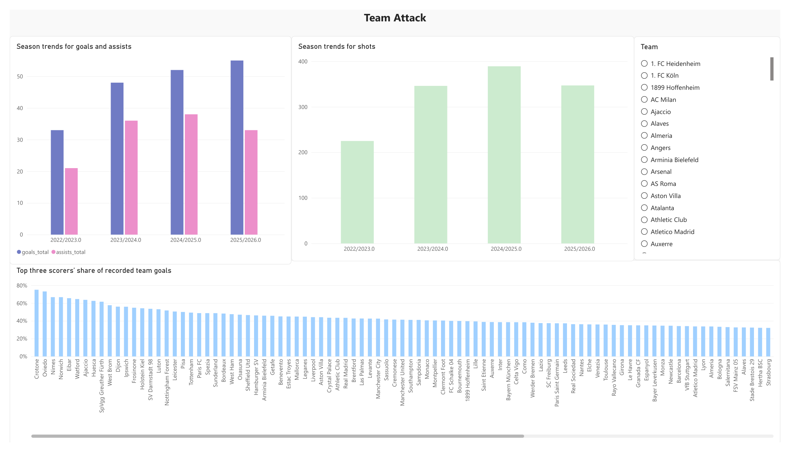
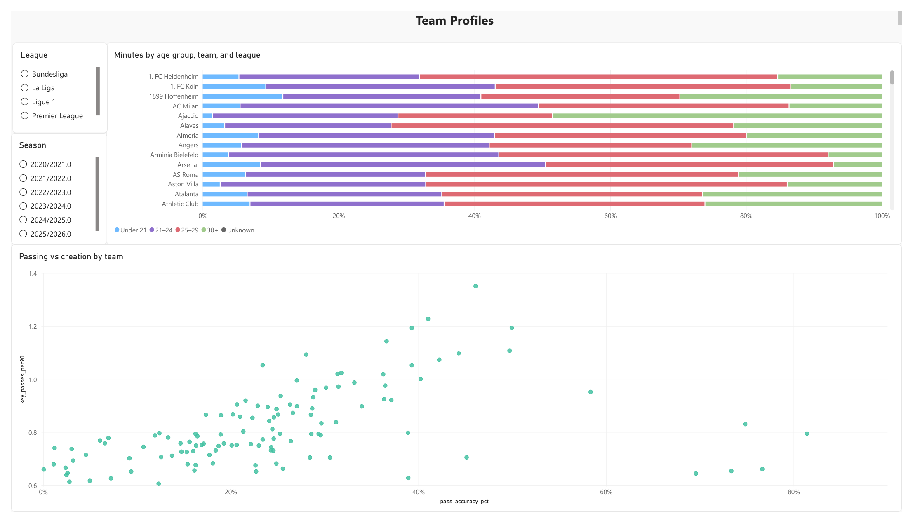
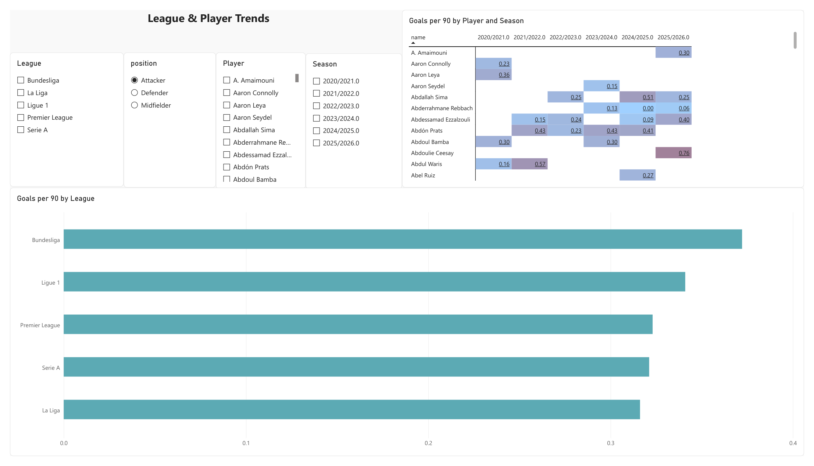

# Recruitment Intelligence: Scoring Depth, Player Consistency, and Squad Development

**Stakeholder briefing | October 9, 2026**
**Analysis window:** 2020/21–2025/26; season-start year 2026 excluded.
**Coverage:** Five European leagues, 12,723 recorded player stints, and 4,586 distinct players.

[View the Power BI report PDF](../Soccer_analytics.pdf)

## Business objective

A recruitment team needs to identify where additional scouting could improve scoring depth and which players merit detailed evaluation. Raw totals favor players with more playing time, individual standout seasons can distort comparisons, and reviewing a broad candidate pool manually makes consistent screening difficult.

This analysis supports three decisions:

1. Which teams show recurring concentration of scoring contributions?
2. Which players sustain relevant output over multiple seasons and substantial minutes?
3. How should league context and historical age participation inform further review?

This is a hypothetical recruitment case study. It demonstrates decision support rather than a completed client engagement or measured transfer outcome.

## Executive findings and recommended decisions

| Finding | Business relevance | Recommended action |
|---|---|---|
| Crystal Palace's annual top-three goal share averaged 64.6%, exceeding 60% in five seasons | Scoring concentration recurs across the analysis window | Review contributions outside the leading trio and investigate whether additional attacking depth is warranted |
| Several forwards met the scoring criterion in all six qualified seasons | Repeated output provides stronger screening evidence than a single high-rate season | Apply the same qualification to the wider candidate pool before detailed scouting |
| Bundesliga attackers led scoring rates in four of six seasons, but the league ranking changed | Raw player rates require season and league context | Benchmark candidates against same-position league peers rather than comparing rates in isolation |
| PSG's under-25 minutes share increased from 36.3% to 69.9% between endpoints | Playing-time participation shifted substantially | Review the players and intervening seasons to understand the change before attributing it to a development strategy |

The recommended outcome is a **prioritized list for further scouting**, supported by consistent criteria and traceable evidence. These findings do not independently establish tactical fit, affordability, or future performance.

## 1. Team Attack: identify scoring-depth questions

*Report snapshot from the supplied PDF. Saved team selections and visual interactions may differ from the comparison scope below.*

### Recurring annual concentration

| Team | Mean annual top-three goal share | Seasons with share ≥60% |
|---|---:|---:|
| Crystal Palace | 64.6% | 5 of 6 |
| Tottenham | 63.3% | 3 of 6 |
| Aston Villa | 61.6% | 3 of 6 |
| Lyon | 61.2% | 4 of 6 |
| Osasuna | 61.0% | 3 of 6 |

These are the highest mean shares among clubs recording at least 30 goals in each of the six seasons. Each season receives equal weight, and its leading three scorers are identified separately.

**Interpretation:** Crystal Palace's concentration is repeated rather than confined to one exceptional season. The next question is whether other contributors provide sufficient scoring depth. Concentration can also reflect successful specialists; it is not automatically evidence of a weakness.

**Decision:** Examine the latest qualified season and the players outside the leading trio before recommending a recruitment priority. Use goals, shots, conversion, and individual profiles together to distinguish a depth question from changes in shooting volume or finishing.

### Continuity across the whole window

The current multi-season chart instead selects the same three players over the entire selected window. For example, Tottenham's three leading contributors account for **171 of 347 recorded goals (49.3%)** across 2020–2025.

That answers a different question: how concentrated scoring was among persistent contributors across the window. It does not reproduce the 63.3% mean annual share above. Clubs with different numbers of covered seasons should not be ranked without acknowledging promotion, relegation, and coverage differences.

## 2. Team Profiles: understand playing-time allocation

*The age visual switches between historical and current-age grouping. Select explicit seasons to interpret age at the season reference date. Passing accuracy remains under validation.*

### Historical youth participation

| Team | Under-25 minutes, 2020/21 | Under-25 minutes, 2025/26 | Change |
|---|---:|---:|---:|
| Strasbourg | 29.7% | 95.1% | +65.4 percentage points |
| Parma | 22.2% | 67.2% | +45.0 percentage points |
| Paris Saint Germain | 36.3% | 69.9% | +33.6 percentage points |
| Genoa | 15.2% | 47.9% | +32.7 percentage points |
| Lazio | 6.9% | 34.5% | +27.6 percentage points |

These are the largest endpoint increases among teams represented in both endpoint seasons. Age is measured on July 1 of each season-start year. Missing birth dates remain in total minutes but are not counted as under 25.

**Interpretation:** The figures identify changing participation by younger players. They do not distinguish academy graduates from young signings or prove a deliberate recruitment strategy. Endpoint changes also do not establish a steady annual trend.

**Decision:** Review the underlying players and year-by-year progression before drawing conclusions about squad development. Validate Strasbourg's extreme endpoint against player coverage and birth dates before using it as an external headline.

### Passing-quality conclusions are deferred

The estimated passing-accuracy calculation produces values that require source validation, including 44.1% for PSG and 12.2% for Manchester United in 2024/25. The provider field's meaning and missing-data coverage must be confirmed before this scatter supports a passing-quality recommendation. It remains exploratory.

## 3. League and Player Trends: screen sustained output in context

*The exported view shows the attacker selection. The interactive report changes metrics by position: goals, key passes, or tackles per 90. A static PDF does not retain slicer interactions.*

### Sustained scoring over qualified seasons

| Player | Seasons with ≥900 attacker minutes | Seasons with ≥0.40 goals/90 | Lowest qualified-season rate |
|---|---:|---:|---:|
| Erling Haaland | 6 | 6 | 0.722 |
| Kylian Mbappé | 6 | 6 | 0.831 |
| Robert Lewandowski | 6 | 6 | 0.620 |
| Harry Kane | 6 | 6 | 0.473 |
| Serhou Guirassy | 6 | 6 | 0.510 |

These established players illustrate the screen, not a presumed affordable shortlist. Candidates require at least four qualified seasons; the examples rank by strong-season count, then weighted scoring rate. The 0.40 threshold is an analytical choice.

**Decision:** Apply the screen to the wider pool and investigate candidates through linked Streamlit profiles, peer comparisons, and similar-player search. Scoring history must be supplemented with video and role assessment; penalties and expected goals are not controlled here.

**Sample-size discipline:** Lookman's recorded 2025/26 rate is 0.579 goals/90 over 622 minutes. Despite the high rate, that season does not qualify for the 900-minute heatmap. Blank qualified cells should not be interpreted as zero output.

### League benchmark changes over time

| Season | Highest included attacker scoring rate | Goals per 90 attacker-minutes |
|---|---|---:|
| 2020/21 | Serie A | 0.391 |
| 2021/22 | Bundesliga | 0.378 |
| 2022/23 | Bundesliga | 0.366 |
| 2023/24 | Bundesliga | 0.396 |
| 2024/25 | Bundesliga | 0.395 |
| 2025/26 | Ligue 1 | 0.355 |

**Interpretation:** Bundesliga leads in four seasons, but the ranking is not fixed. Rates describe the included attacker sample, not league strength or goals per match.

**Decision:** Present each candidate's rate with a same-position, same-season league benchmark. Do not apply an unvalidated league adjustment factor or treat a raw scoring rate as directly transferable to another competition.

## Recommended review workflow

1. Select a team and season to identify a specific scoring-depth or playing-time question.
2. Establish the relevant position and league comparison group.
3. Screen player-season output with a minimum of 900 minutes.
4. Open selected player-season profiles in Streamlit and review peers and alternatives.
5. Document the evidence, remaining uncertainties, and candidates recommended for video review.

The intended benefit is a more consistent initial screening process. Success should be evaluated through time to produce an evidence-backed shortlist, compliance with screening criteria, expert acceptance for further review, and reproducibility. No time savings or recruitment returns have yet been measured.

## Evidence and decision boundaries

- Numerical findings were calculated from the local DuckDB snapshot, not extracted from the PDF or PBIX cache. Refresh the report and match documented filters before reproducing them.
- Source models exclude player stints below 300 minutes. Recorded goals and minutes can differ from official team totals. Similar sample sizes do not establish season completeness.
- Rates use `90 × sum(events) / sum(minutes)`; player rates are not averaged. The 900-minute criterion qualifies player-seasons, not whole leagues.
- Current-age mode groups historical minutes by age today; it does not represent the current squad. Historical youth findings require explicit season filters.
- Goals, key passes, and tackles describe different aspects of output. They do not constitute a common overall-performance score.
- Financial, medical, contractual, and tactical assessments remain necessary before recruitment decisions.

[Open the full report PDF](../Soccer_analytics.pdf)
